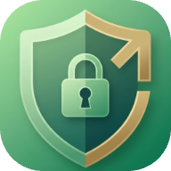

<p align="center">
  
</p>

<h1 align="center">ScrollGuard</h1>

<p align="center">
  A Chrome extension that tracks Instagram usage by context (reels, stories, feed, DMs, explore, profile) and blocks you when you've spent too long in any of them. Built as a personal behavioral-intervention tool — not a polished product.
</p>

---

Whenever you hit a time limit (that you set) on reels or just by scrolling through your IG feed on the website, the extension will take over the page with a full-screen block overlay and pause anything in the background until the cooldown (that you set) expires or you enter a password for a short grace period. 

## Screenshots
<p align="center">
  
</p>

<p align="center">
  
</p>


## Why I built this

Even when I block doomscrolling apps on my phone, I sometimes still scroll on my computer. I wanted to make my own app to address my specific needs and enhance my learning of CI/CD and JavaScript. 

## What I learned

- **GitHub Actions for release automation.** Wrote my first CI workflow that triggered on 'v*' tags and packages the extension and publishes a GitHub release. Small in scope, but the patterns generalize to every CI/CD platform.
  
- **Using Chrome Storage to survive outsmarting the blocker.** Manifest V3 service workers die after ~30 seconds of inactivity, which breaks any extension built around long-running timers. I used a single timestamp in chrome.storage.local so anytime IG is opened and it's in the block state, it just compares to the current clock. This means the block persists when IG is idle, when the browser restarts, when the entire computer restarts, and in pretty much anything. Storage outlives processes, and this is the same idea behind REST APIs, JWTs, and other distributed systems work.

- **Coordinating tricky parts of the design.** I initially planned to track time across all tabs, but was confused on how to figure out which one was the real session. After some edge cases, I decided to switch and calculate time based on independent tabs and sum them up in the dashboard at read time. This design choice saved a lot of maintenance later on.

- **Tracking Active Time.** I needed three separate signals to track the active amount of time spent on reels: chrome.tabs.onActivated (is it active in the window?), chrome.windows..onFocusChanged (is the window focused?), and the Page Visibility API (is the page visible as in it's not behind another window?). While I had these concerns during design, it was interesting to see how they were technically built into APIs and composed in code.

- **CSS isolation on a site I don't control.** When I first tried making the overlay using regular DOM nodes, IG's CSS still leaked through. I then rebuilt a shadow DOM, which was like an isolated bubble of HTML and CSS that the page couldn't reach into.

## Tech Stack
- **JavaScript**
- **GitHub Actions** Automated release packaging
- **Chrome Extension Manifest V3** Service Worker + Content Scripts
- **Shadow DOM** For the overlay

## Features

- **Per-context tracking.** Reels, stories, IG feed, profile, and DM's are all tracked separately. DM's do not count towards the limit.
- **Active vs Passive Time** Reels and stories only count time when the tab is focused and visible. Closing your device or switching tabs stops the clock.
- **Block + cooldown.** When a group hits its limit, every context in that group is blocked for the full cooldown duration (default 30 min).
- **Password** A correct password buys you a fixed unlock window (default 30 sec), then the block resumes for the rest of its cooldown.
- **Session classification.** Each Instagram session is classified at end as `quick_check` (<60s), `browsing` (1–5 min), or `deep_scroll` (>5 min) for retrospective awareness. Each session of usage is classified as either a *quick check* (<60s), *browsing* (1-5min) or a *deep scroll* (>5 minutes).
- **Popup dashboard.**  Extension dashboard displays daily active time with threshold-based coloring, session count, session classification, current block countdowns, and time limit settings. 
- **Edge Cases** Any restarts, browser shutdowns, or device shutdowns fail to break the blocker. All state lives in `chrome.storage.local`.

## Install

Download the latest release: [Releases page](https://github.com/RayyanHai/ScrollGuard/releases/latest)

1. Download `scrollguard-vX.Y.Z.zip`
2. Unzip it somewhere stable (not your Downloads folder)
3. Open `chrome://extensions`
4. Enable Developer mode (top-right)
5. Click "Load unpacked" and select the unzipped folder

## Configuration

- Scroll Limit: Time limit for feed + stories
- Reels Limit: Time limit for just reels
- Other limit: Time limit for explore, profile, and other random pages
- Block cooldown: How long your IG is blocked for after reaching a limit
- Unlock Grace: How much time a password unlock grants you
- Password: Phrase to bypass a block

## How it works

```
nav events  →  per-tab session/segment tracking
              ↓
           1-second tick
              ↓
   per-group active-time accumulator
              ↓
       limit check → block state
              ↓
   content script BLOCK / UNLOCK / CLEAR
```

- **Service worker** (`background/service-worker.js) is the brain. Listens to `webNavigation`, `tabs`, and `windows` events; runs a 1-second `setInterval` that decides what state each tab should be in.
- **Content script** (`content/detector.js`, `content/intervention.js`) runs in the Instagram page. Reports Page Visibility, renders the block overlay in a Shadow DOM, and pauses videos when blocked.
- **Storage** (`chrome.storage.local`, wrapped in `lib/storage.js`) holds in-flight sessions, completed sessions bucketed by date, the per-group active-time counter, the current block state, and user-edited config.

## Roadmap

Some things I have planned for the future of the project given more time:

- **More Platform.s** Extend usage across different platforms like TikTok and YouTube shorts that both use similar styles of scrolling and feeds.

- **Continuous Integration.** Add unit tests for the rules engine and run them on every PR

- **Dashboard data export.** Export the session log as JSON or CSV for any personal purposes.

## License

All rights reserved. This project is published as a portfolio piece for reference. You may not copy, modify, or redistribute the code without permission.
